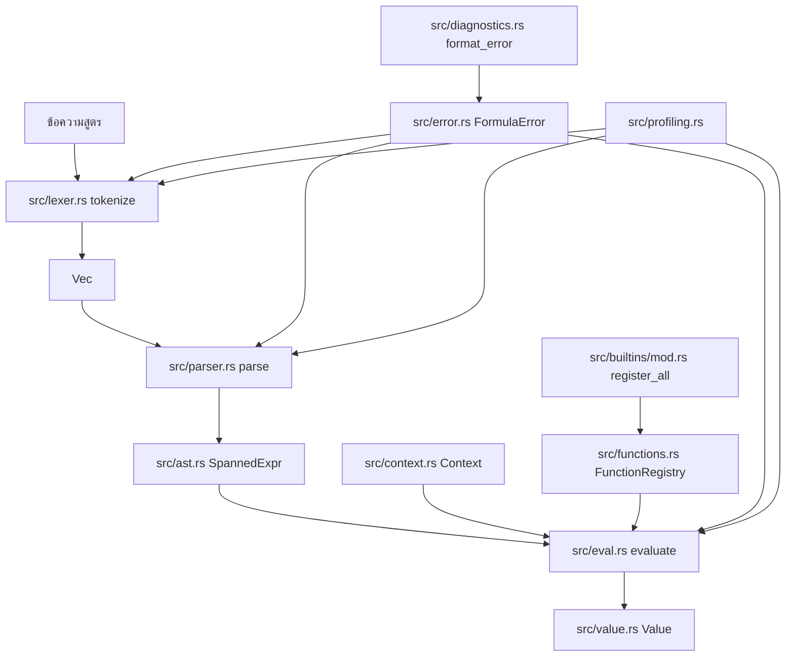
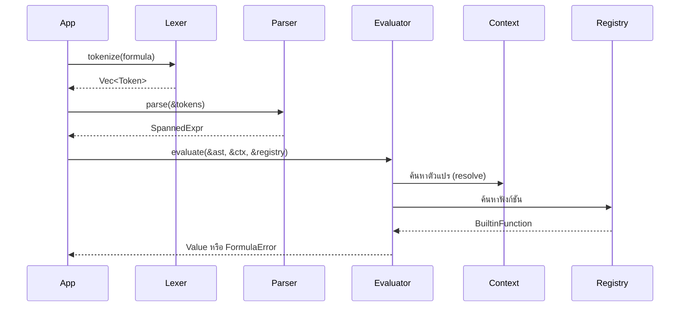

`bl1z` ถูกจัดระเบียบให้เป็น Crate ที่มีการแบ่งชั้น (Layered) อย่างจงใจ จุดเข้าใช้งานสาธารณะใน `src/lib.rs` จะส่งออก (re-export) API ที่ใช้งานบ่อย แต่การทำงานจริงยังคงแยกตามความรับผิดชอบ: การวิเคราะห์คำศัพท์ (Lexical Analysis) ใน `src/lexer.rs`, การสร้าง AST ใน `src/parser.rs` และ `src/ast.rs`, การประมวลผล (Evaluation) ใน `src/eval.rs`, สถานะรันไทม์ (Runtime State) ใน `src/context.rs` และ `src/value.rs`, จุดขยาย (Extension Points) ใน `src/functions.rs` และ `src/builtins`, และการวินิจฉัยสำหรับผู้ใช้ (User-facing Diagnostics) ใน `src/error.rs`, `src/diagnostics.rs` และ `src/profiling.rs`

## Module Relationships

## Request And Data Lifecycle

## Why the Crate is Separated This Way

### 1. Intentional Separation of Parsing and Evaluation

`src/lib.rs` เปิดเผยฟังก์ชัน `tokenize`, `parse` และ `evaluate` ให้เป็นคนละการเรียกใช้งาน แทนที่จะซ่อนทุกอย่างไว้หลัง helper ตัวเดียว ทางเลือกนี้มีความสำคัญในเชิงปฏิบัติการ: คุณสามารถ parse เพียงครั้งเดียว เก็บ `SpannedExpr` ไว้ และประมวลผล (evaluate) มันหลายๆ ครั้งด้วยบริบท (contexts) ที่แตกต่างกัน ยูทิลิตี้การเก็บสถิติ (Profiling) ใน `src/profiling.rs` ยังได้รับประโยชน์จากการแยกนี้เพราะสามารถวัดผลในแต่ละขั้นตอนแยกกันได้ ในทางปฏิบัติ มันสร้างขอบเขตที่ชัดเจนระหว่างการตรวจสอบไวยากรณ์ (Syntax Validation) และการดำเนินการที่ขับเคลื่อนด้วยข้อมูล (Data-driven Execution)

### 2. Runtime Extensibility via Registry, Not AST Traits

พฤติกรรมที่กำหนดเองจะถูกแนบผ่าน `FunctionRegistry` ใน `src/functions.rs` ตัวประมวลผล (Evaluator) ใน `src/eval.rs` จะค้นหาโหนด `FunctionCall` ตามชื่อ ตรวจสอบจำนวนอาร์กิวเมนต์ (arity) ประมวลผลอาร์กิวเมนต์ทุกตัว แล้วเรียกใช้ function pointer ที่เก็บไว้ สิ่งนี้ทำให้ AST เรียบง่ายและดูเหมือนข้อมูลที่ serialize ได้ ในขณะที่ทำให้ฟังก์ชันเป็นจุดขยายหลัก นอกจากนี้ยังหมายความว่าส่วนหน้าของภาษา (Language Surface) ยังคงเสถียร แม้ว่าทีมแอปพลิเคชันจะเพิ่มการดำเนินการเฉพาะด้านก็ตาม

### 3. Spans Propagate Through the Tree

`src/ast.rs` ห่อหุ้มทุกนิพจน์ (expression) ไว้ใน `SpannedExpr` ซึ่งใน `ExprMeta` จะเก็บข้อมูล `Span` ตัววิเคราะห์ (Parser) จะรวม span เข้าด้วยกันเมื่อสร้างนิพจน์ที่ใหญ่ขึ้น และข้อผิดพลาดในการวิเคราะห์คำศัพท์, ไวยากรณ์ และการประมวลผลสามารถแนบข้อมูลตำแหน่งได้ ข้อมูลตำแหน่งนั้นจะถูกจัดรูปแบบในภายหลังใน `src/diagnostics.rs` พร้อมกับบรรทัดต้นฉบับดั้งเดิมและเครื่องหมายระบุตำแหน่ง ผลลัพธ์ที่ได้คือโหมดความล้มเหลวที่ดีกว่าการส่งกลับเพียงข้อความธรรมดาโดยไม่มีบริบท

### 4. The Runtime is Deliberately Strict

ตัวประมวลผลใน `src/eval.rs` รับเฉพาะการรวมประเภทข้อมูลที่ชัดเจนเท่านั้น `+` ทำงานกับ `Number + Number` และ `String + String`, การเปรียบเทียบเป็นแบบตัวเลข และตรรกะ boolean ต้องการข้อมูลประเภท boolean ระบบนี้ไม่มีชั้นการแปลงประเภท (Coercion Layer) การออกแบบนี้ช่วยลดความคลุมเครือและทำให้สูตรของผู้ใช้คาดเดาผลลัพธ์ได้ง่าย แต่มันก็ส่งภาระการตรวจสอบความถูกต้องไปยังขั้นตอนการเขียนสูตรมากขึ้น

## How the Components Fit Together

Lexer เปลี่ยนข้อความดิบให้เป็นค่า `Token` พร้อมข้อมูล `Span` ที่แม่นยำ `src/lexer.rs` จัดการตัวดำเนินการ (operators), การหลีกอักขระในสตริง (string escapes), ชื่อตัวแปร (identifiers), คำสำคัญ (keywords) เช่น `true`, `false`, `null` และโทเค็นโครงสร้างสำหรับอาร์เรย์และแมป และจะแนบโทเค็น `Eof` ไว้ที่ส่วนท้ายเพื่อช่วยให้ตัววิเคราะห์ทำงานง่ายขึ้น

Parser ใน `src/parser.rs` ใช้โครงสร้างแบบ recursive-descent มาตรฐานพร้อมเมธอดช่วยสำหรับการจัดลำดับความสำคัญของตัวดำเนินการ (Operator Precedence) ฟังก์ชัน `parse_left_associative_binary` จะรวมรูปแบบการทำงานที่ซ้ำกันสำหรับระดับลำดับความสำคัญของ `||`, `&&`, ความเท่ากัน, การเปรียบเทียบ, พจน์ (term) และปัจจัย (factor) จากนั้น `parse_primary` จะจัดการค่าคงที่ (literals), นิพจน์ในวงเล็บ, การเรียกฟังก์ชัน, อาร์เรย์, แมป และชื่อตัวแปรที่มีเครื่องหมายจุดแยก เช่น `user.score`

Evaluation เดินผ่าน AST แบบ recursive ใน `src/eval.rs` ค่าคงที่จะคืนผลลัพธ์ทันที ตัวแปรจะถูกค้นหาผ่าน `Context` รวมถึงการเดินเข้าไปในอินสแตนซ์ `Value::Map` ที่ซ้อนกันเมื่อชื่อตัวแปรมีเครื่องหมายจุด การเรียกฟังก์ชันจะค้นหา `BuiltinFunction` ใน registry ตรวจสอบจำนวนอาร์กิวเมนต์ที่ถูกต้อง ประมวลผลอาร์กิวเมนต์ และเรียกใช้การทำงานที่ลงทะเบียนไว้ อาร์เรย์และแมปจะประมวลผลลูกๆ ของมันทันที (eagerly) เข้าสู่คอนเทนเนอร์ `Value` ในรันไทม์

Built-ins ถูกเก็บไว้ในไฟล์แยกกันตามโดเมน `src/builtins/mod.rs` เป็นศูนย์กลางการลงทะเบียนเพื่อให้โค้ดแอปพลิเคชันสามารถเลือกใช้ชุดฟังก์ชันมาตรฐานทั้งหมดได้ด้วยการเรียกใช้ครั้งเดียว ตัวช่วยการเก็บสถิติใน `src/profiling.rs` ถูกแยกออกมาจากเส้นทางการประมวลผลหลักโดยจงใจ โดยใช้ API สาธารณะแทนการพึ่งพา hook ภายใน ซึ่งช่วยให้รันไทม์หลักมีขนาดเล็กและเข้าใจได้ง่ายขึ้น

## Design Constraints to Keep in Mind

- `if()` ถูกส่งค่าเข้าไปเหมือนฟังก์ชันปกติใน `src/builtins/logic.rs` และตัวประมวลผลจะประมวลผลอาร์กิวเมนต์ทุกตัวก่อนเรียกใช้เสมอ นั่นหมายความว่าทั้งสองเงื่อนไขจะถูกประมวลผลล่วงหน้าทันที (eager evaluation)
- `&&` และ `||` ก็ทำงานแบบ eager ใน `src/eval.rs` เช่นกัน โดยไม่มีตรรกะลัด (short-circuit logic)
- การเข้าถึงด้วยเครื่องหมายจุด (Dot access) ถูกระบุเป็นการค้นหาชื่อตัวแปรที่แยกส่วน ไม่ใช่โหนด AST สำหรับการเข้าถึง property ทั่วไป มันทำงานได้กับตัวแปรใน `Context` ที่รองรับโดย `Value::Map` ที่ซ้อนกัน แต่ไม่สามารถใช้กับผลลัพธ์ของนิพจน์ทั่วไปได้
- `date_diff()` ใน `src/builtins/date.rs` รับอาร์กิวเมนต์สามตัว แต่อาร์กิวเมนต์ที่สาม `unit` ปัจจุบันถูกละเว้น แม้ว่าตัวอย่างจะส่งค่า `"days"` เข้าไปก็ตาม

ข้อจำกัดเหล่านี้ไม่ใช่รายละเอียดทางเอกสารที่เกิดขึ้นโดยบังเอิญ แต่มันมาจากการนำไปใช้งานจริง ดังนั้นคุณควรคำนึงถึงสิ่งเหล่านี้เมื่อออกแบบสูตรและเมื่อนำเสนอวิธีการเขียนสูตรให้กับผู้ใช้ปลายทาง
