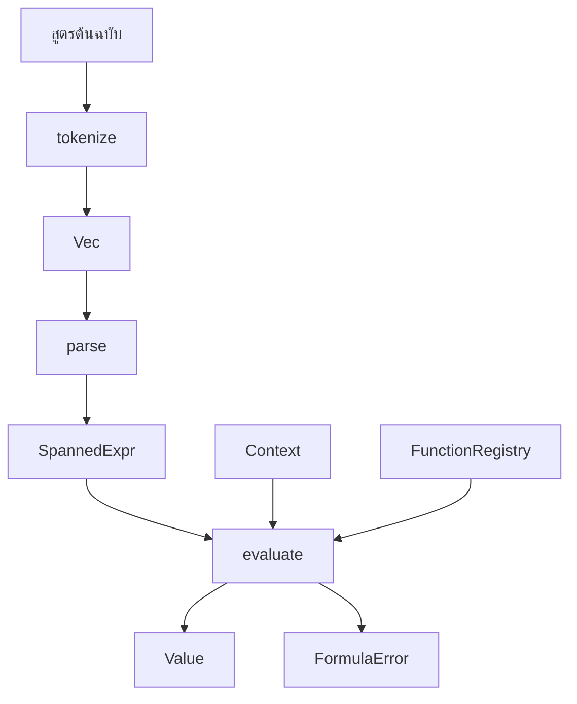

Execution pipeline คือหัวใจของ `formula_engine` ทุกสูตรจะเคลื่อนที่ผ่านสามขั้นตอนที่ชัดเจนซึ่งถูกเปิดเผยจาก crate root: `tokenize`, `parse` และ `evaluate` สิ่งนี้ไม่ใช่แค่สไตล์ของ API แต่มันสะท้อนถึงการแยกการทำงานจริงใน `src/lexer.rs`, `src/parser.rs` และ `src/eval.rs` และยังช่วยให้คุณควบคุมการทำ caching, การตรวจสอบความถูกต้อง (validation) และการรายงานข้อผิดพลาดได้อย่างมีประสิทธิภาพ

## What This Concept Is

Pipeline นี้ทำหน้าที่แปลงข้อความต้นฉบับที่ไม่น่าเชื่อถือหรือเขียนโดยผู้ใช้ให้เป็นผลลัพธ์รันไทม์ที่มีประเภทข้อมูลชัดเจน Lexer จะสร้างค่า `Token` พร้อมข้อมูล span, Parser จะเปลี่ยนโทเค็นเหล่านั้นให้เป็นโหนด `SpannedExpr` และ Evaluator จะลดรูป AST ให้เหลือค่า `Value` โดยใช้ `Context` และ `FunctionRegistry` หากคุณเข้าใจลำดับขั้นตอนนี้ คุณจะเข้าใจว่าควรตรวจสอบไวยากรณ์ (Syntax Validation) ที่ไหน, ควรแนบข้อมูลการวินิจฉัย (Diagnostics) ที่ไหน และข้อมูลรันไทม์เข้าสู่ระบบที่จุดใด

## Why It Exists

การแยกขั้นตอนช่วยแก้ปัญหาในทางปฏิบัติสามประการ:

- ช่วยให้คุณปฏิเสธสูตรที่ผิดรูปแบบได้ก่อนที่จะเข้าถึงข้อมูลแอปพลิเคชัน
- ช่วยให้สามารถนำ AST กลับมาใช้ใหม่ได้เมื่อมีการประมวลผลสูตรเดิมซ้ำๆ
- ช่วยให้แต่ละขั้นตอนมีขอบเขตข้อผิดพลาดที่ชัดเจนพร้อมข้อมูลตำแหน่ง (location information)

## How It Works Internally

`src/lexer.rs` สแกนสตริงต้นฉบับทีละตัวอักษร โดยจะจดจำตัวเลข, สตริง, identifier, คำสำคัญ (keywords), ตัวดำเนินการ (operators) และอักขระโครงสร้างเช่น `[` และ `{` แต่ละ `Token` ที่ส่งออกมาจะประกอบด้วย `TokenKind`, `lexeme` และ `Span`

`src/parser.rs` ประมวลผลโทเค็นสตรีมด้วย recursive-descent parser ลำดับความสำคัญของตัวดำเนินการถูกกำหนดไว้ใน `parse_logical_or`, `parse_logical_and`, `parse_equality`, `parse_comparison`, `parse_term`, `parse_factor` และ `parse_unary` การใช้ฟังก์ชันช่วย `parse_left_associative_binary` เป็นเหตุผลที่ทำให้การนำไปใช้งานยังคงกระชับในขณะที่ยังรักษาลำดับความสำคัญได้อย่างถูกต้อง `parse_primary` จัดการอาร์เรย์, แมป, นิพจน์ที่จัดกลุ่ม, ค่าคงที่ (literals), ตัวแปร และการเรียกฟังก์ชัน

`src/eval.rs` ประมวลผล AST แบบ recursive ตัวแปรจะถูกอ่านจาก `Context`, ฟังก์ชันถูกค้นหาผ่าน `FunctionRegistry`, อาร์เรย์และแมปจะถูกประมวลผลเป็น `Value::Array` และ `Value::Map` และตัวดำเนินการแบบ binary หรือ unary จะทำการตรวจสอบประเภทข้อมูลอย่างเข้มงวด ข้อผิดพลาดในการประมวลผลจะส่งกลับ `FormulaError` พร้อมรหัสเช่น `E601` สำหรับตัวแปรที่หายไป หรือ `E401` สำหรับปัญหาเรื่องประเภทข้อมูล



## How It Relates To Other Concepts

Pipeline นี้ขึ้นอยู่กับ [Runtime Data Model](/docs/runtime-data-model) เพราะค่ารันไทม์, span และโหนด AST เป็นตัวกำหนดสิ่งที่สามารถแสดงผลได้ในขณะรันไทม์ และยังขึ้นอยู่กับ [Function System](/docs/function-registry) เนื่องจากการเรียกฟังก์ชันจะถูกแก้ไข (resolved) ในระหว่างการประมวลผล เมื่อมีบางอย่างล้มเหลว โมเดล [Error Reporting](/docs/error-reporting) จะเป็นตัวกำหนดสิ่งที่คุณสามารถแสดงให้ผู้ใช้เห็นได้

## Basic Usage

```rust
use formula_engine::builtins;
use formula_engine::{evaluate, parse, tokenize, Context, FunctionRegistry};

fn main() -> Result<(), Box<dyn std::error::Error>> {
    let mut registry = FunctionRegistry::new();
    builtins::register_all(&mut registry);

    let tokens = tokenize("1 + 2 * 3")?;
    let ast = parse(&tokens)?;
    let result = evaluate(&ast, &Context::new(), &registry)?;

    assert_eq!(format!("{result:?}"), "Number(7.0)");
    Ok(())
}
```

## Advanced Usage: Parse Once, Evaluate Many Times

เนื่องจากการทำ parsing และ evaluation แยกออกจากกัน คุณจึงสามารถเฉลี่ยต้นทุนการ parse สำหรับการประมวลผลซ้ำๆ ได้

```rust
use formula_engine::builtins;
use formula_engine::{evaluate, parse, tokenize, Context, FunctionRegistry, Value};

fn main() -> Result<(), Box<dyn std::error::Error>> {
    let mut registry = FunctionRegistry::new();
    builtins::register_all(&mut registry);

    let tokens = tokenize("score + bonus")?;
    let ast = parse(&tokens)?;

    let mut a = Context::new();
    a.set("score", Value::Number(80.0));
    a.set("bonus", Value::Number(5.0));

    let mut b = Context::new();
    b.set("score", Value::Number(92.0));
    b.set("bonus", Value::Number(3.0));

    let first = evaluate(&ast, &a, &registry)?;
    let second = evaluate(&ast, &b, &registry)?;

    assert_eq!(format!("{first:?}"), "Number(85.0)");
    assert_eq!(format!("{second:?}"), "Number(95.0)");
    Ok(())
}
```

<Callout type="warn">`evaluate` ทำงานแบบ eager ใน `src/eval.rs` ตัวดำเนินการแบบ binary จะประมวลผลทั้งสองฝั่งก่อนที่จะใช้ตัวดำเนินการ และการเรียกฟังก์ชันจะประมวลผลทุกอาร์กิวเมนต์ก่อนที่จะเรียกใช้ฟังก์ชันที่ลงทะเบียนไว้ นั่นหมายความว่า `if(cond, a, b)` จะคำนวณทั้ง `a` และ `b` และ `&&` หรือ `||` จะไม่มีตรรกะแบบ short-circuit</Callout>

## Common Trade-Offs

<Accordions>
<Accordion title="ทำไม crate ถึงแยกเป็นสามฟังก์ชันแทนที่จะเป็น helper ตัวเดียว">
การแยก `tokenize`, `parse` และ `evaluate` ต่อสาธารณะทำให้โค้ดที่เรียกใช้ดูยาวขึ้นเล็กน้อย แต่มันช่วยให้คุณควบคุมเวลาที่แต่ละขั้นตอนจะทำงานได้อย่างชัดเจน สิ่งนี้สำคัญหากสูตรถูกเขียนโดยผู้ใช้และควรตรวจสอบไวยากรณ์เพียงครั้งเดียวเมื่อบันทึก แล้วจึงนำไปประมวลผลหลายครั้งในภายหลัง นอกจากนี้ยังช่วยปรับปรุงการทำ profiling เพราะ `src/profiling.rs` สามารถวัดผลแต่ละขั้นตอนแยกกันได้ แทนที่จะมองการประมวลผลเป็นกล่องดำ หากคุณต้องการฟังก์ชัน helper แบบเรียกใช้ครั้งเดียวในแอปพลิเคชันของคุณ คุณสามารถสร้างมันขึ้นมาบน API สาธารณะหลังจากตัดสินใจแล้วว่าการทำ AST caching มีความสำคัญต่อภาระงานของคุณหรือไม่
</Accordion>
<Accordion title="ทำไม parser ถึงใช้ recursive descent แทนที่จะเป็นไวยากรณ์ที่สร้างขึ้นอัตโนมัติ">
Parser ใน `src/parser.rs` นั้นตรงไปตรงมาในการตรวจสอบและขยาย โดยเฉพาะอย่างยิ่งสำหรับภาษาที่มีลำดับความสำคัญของตัวดำเนินการคงที่ขนาดเล็ก การเพิ่มการรองรับอาร์เรย์, แมป และการเรียกฟังก์ชันต้องการเพียงการเปลี่ยนแปลงใน `parse_primary` พร้อมกับการรองรับโทเค็นใน lexer ข้อเสียคือฟีเจอร์บางอย่างของภาษา เช่น การเข้าถึง property ทั่วไป หรือโหนด control-flow แบบ lazy ต้องการการเปลี่ยนแปลงโครงสร้าง AST แทนที่จะเป็นเพียงการปรับแต่งไวยากรณ์เล็กน้อย สำหรับขอบเขตของ crate นี้ ความตรงไปตรงมาของ parser ที่เขียนด้วยมือถือว่าเหมาะสมเพราะการนำไปใช้งานยังคงกระชับและเข้าใจง่าย
</Accordion>
</Accordions>

เมื่อคุณคุ้นเคยกับ pipeline แล้ว ให้ไปที่ [Function System](/docs/function-registry) เพื่อทำความเข้าใจว่าสูตรเข้าถึงพฤติกรรมเฉพาะของแอปพลิเคชันได้อย่างไร หรือข้ามไปที่ [API Reference](/docs/api-reference/syntax-and-evaluation) เพื่อดูลายเซ็นฟังก์ชันทั้งหมด
