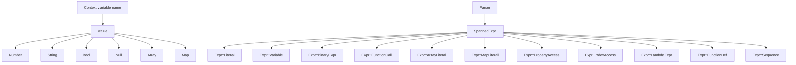

The runtime data model is the contract between the parser and evaluator. In `bl1z`, this model is spread across `src/value.rs`, `src/context.rs`, `src/ast.rs`, and `src/span.rs`. Together, those modules answer four questions: what values formulas can produce, how external data is injected, how expressions are represented, and how source locations are preserved.

## What This Concept Is

The crate reduces formulas into a single runtime enum, `Value`, and represents syntax with `Expr` wrapped in `SpannedExpr`. Application data is stored in `Context`, which uses deterministic per-scope storage plus parent-linked lookup. `Span` and `Position` attach human-usable coordinates to syntax and errors.

## Why It Exists

This model solves a common problem in formula systems: once you accept a dynamic language, you still need a predictable internal representation. `Value` provides that representation, `Context` creates the boundary between formula code and host application data, and spans allow diagnostics to point back into the original source instead of failing opaquely.

## Internal Structure

`src/value.rs` defines:

```rust
pub enum Value {
    Number(f64),
    String(String),
    Bool(bool),
    Null,
    Array(Vec<Value>),
    Map(std::collections::HashMap<String, Value>),
    Lambda(...),
    DateTime(jiff::Timestamp),
    Duration(bl1z::value::Duration),
    Set(std::collections::HashSet<Value>),
    Range { start: i64, end: i64, step: i64 },
}
```

`src/context.rs` stores variables in a private `BTreeMap<String, Value>` for each scope and exposes `new`, `set`, `get`, `with_parent`, `get_all`, and `depth`. During evaluation, `src/eval.rs` resolves variables by name and supports explicit AST nodes for property access and indexing.

`src/ast.rs` defines the syntax tree. The important part is that every expression becomes a `SpannedExpr`, which wraps an `Expr` plus `ExprMeta { span }`. Arrays and maps are first-class nodes in the AST, not post-processing tricks.



## How It Relates To Other Concepts

The [Execution Pipeline](/docs/execution-pipeline) produces these structures, the [Function System](/docs/function-registry) consumes them, and the [Error Reporting](/docs/error-reporting) layer relies on `Span` to produce useful diagnostics. If you want nested object-style access in formulas, this page is where the behavior is defined.

## Basic Usage: Supplying Variables

```rust
use bl1z::builtins;
use bl1z::{evaluate, parse, tokenize, Context, FunctionRegistry, Value};

fn main() -> Result<(), Box<dyn std::error::Error>> {
    let mut registry = FunctionRegistry::new();
    builtins::register_all(&mut registry);

    let mut ctx = Context::new();
    ctx.set("subtotal", Value::Number(120.0));
    ctx.set("discount", Value::Number(20.0));

    let ast = parse(&tokenize("subtotal - discount")?)?;
    let result = evaluate(&ast, &ctx, &registry)?;

    assert_eq!(format!("{result:?}"), "Number(100.0)");
    Ok(())
}
```

## Advanced Usage: Nested Maps With Dot Access

```rust
use bl1z::builtins;
use bl1z::{evaluate, parse, tokenize, Context, FunctionRegistry, Value};
use std::collections::HashMap;

fn main() -> Result<(), Box<dyn std::error::Error>> {
    let mut registry = FunctionRegistry::new();
    builtins::register_all(&mut registry);

    let mut profile = HashMap::new();
    profile.insert("name".to_string(), Value::String("Alice".to_string()));
    profile.insert("score".to_string(), Value::Number(91.0));

    let mut user = HashMap::new();
    user.insert("profile".to_string(), Value::Map(profile));

    let mut ctx = Context::new();
    ctx.set("user", Value::Map(user));

    let ast = parse(&tokenize("if(user.profile.score > 90, upper(user.profile.name), \"review\")")?)?;
    let result = evaluate(&ast, &ctx, &registry)?;

    assert_eq!(format!("{result:?}"), "String(\"ALICE\")");
    Ok(())
}
```

<Callout type="warn">Property access still requires `Value::Map`-like intermediate values, but the language now supports both array indexing (`items[0]`) and chained access on evaluated expressions when the intermediate runtime values support it. Quoted keys in map literals are still not part of the formula syntax.</Callout>

## Trade-Offs

<Accordions>
<Accordion title="Why Value is a single enum instead of generic typed expressions">
A single `Value` enum makes the evaluator in `src/eval.rs` simple to implement and reason about. Every operator and built-in can inspect a small fixed set of variants, and application code can store nested structures without creating custom trait objects. The trade-off is that all type validation happens at runtime, so incorrect formulas fail during evaluation with `E401` instead of being rejected statically by the Rust type system. For a user-authored formula language, that trade is usually worth it because the host application still controls what data enters the runtime.
</Accordion>
<Accordion title="Why maps use identifier keys in formulas">
Map literals in `src/parser.rs` accept only identifier keys, as shown by the parser branch that expects `TokenKind::Identifier` before `:`. This keeps the grammar smaller and aligns map access with dot notation, because both assume identifier-like keys. The downside is that keys containing spaces or punctuation cannot be authored directly in formulas even though `Value::Map` itself can store any `String` key. If your application needs arbitrary keys, translate them before inserting into `Context`, or expose helper functions that project complex data into formula-friendly shapes.
</Accordion>
</Accordions>

For the exact definitions and constructor signatures, see [Syntax and Evaluation](/docs/api-reference/syntax-and-evaluation) and [Context and Functions](/docs/api-reference/context-and-functions).
