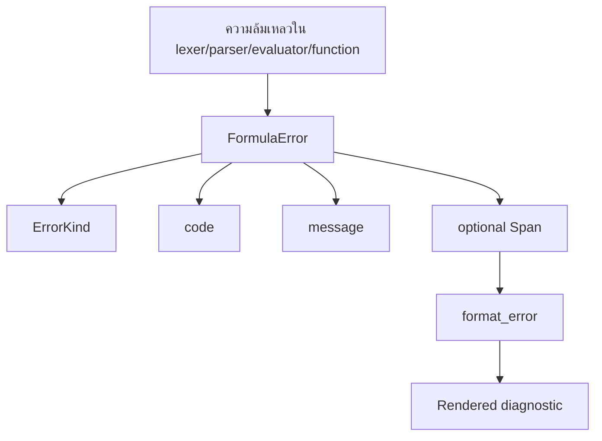

การจัดการข้อผิดพลาดใน `bl1z` ถูกออกแบบให้มีโครงสร้างที่ชัดเจน ไม่ใช่การจัดการแบบเฉพาะหน้า (ad hoc) crate นี้ใช้ `FormulaError` จาก `src/error.rs` สำหรับความล้มเหลวในการวิเคราะห์คำศัพท์ (lexing), การวิเคราะห์ไวยากรณ์ (parsing), การประมวลผล (evaluation), ฟังก์ชัน และบริบท (context) และยังคงรักษาข้อมูล `Span` ไว้ทุกที่ที่เป็นไปได้ เพื่อให้ผู้เรียกสามารถเชื่อมโยงความล้มเหลวกลับไปยังสตริงสูตรต้นฉบับได้

## What This Concept Is

โมเดลข้อผิดพลาดประกอบด้วย:

- `ErrorKind` ซึ่งใช้จัดหมวดหมู่ความล้มเหลว
- `FormulaError` ซึ่งเก็บข้อมูล `kind`, `code`, `message` และ `span` (ไม่บังคับ)
- `format_error` ซึ่งแสดงผลบรรทัดซอร์สโค้ดพร้อมเครื่องหมายระบุตำแหน่ง
- Profiling helpers ใน `src/profiling.rs` ซึ่งไม่ใช่ข้อผิดพลาดในตัวเอง แต่ถูกใช้งานบ่อยครั้งในระหว่างการดีบั๊กและการตรวจสอบสูตร

## Why It Exists

ระบบสูตรมักจะล้มเหลวต่อหน้าผู้ใช้ปลายทางหรือผู้กำหนดค่า ไม่ใช่แค่เหล่านักพัฒนาเท่านั้น การใช้ `panic!` ดิบๆ หรือสตริง `"invalid expression"` ทั่วไปนั้นไม่เพียงพอ เมื่อสูตรถูกเขียนขึ้นใน UI และจัดเก็บไว้ในฐานข้อมูล การรวมกันของประเภทข้อผิดพลาด (error kind), รหัสที่เสถียรสำหรับเครื่อง (machine-stable code) และพิกัดต้นฉบับ ช่วยให้แอปพลิเคชันโฮสต์มีข้อมูลที่นำไปใช้งานต่อได้ เช่น การบันทึก log, การแสดงผล หรือการแปลภาษา

## How It Works Internally

`src/error.rs` กำหนด `ErrorKind` พร้อมหกรูปแบบ: `LexError`, `ParseError`, `EvalError`, `TypeError`, `FunctionError` และ `ContextError` ฟังก์ชัน `FormulaError::new` จะสร้างออบเจ็กต์ข้อผิดพลาด และการนำ `Display` ไปใช้งานจะแสดงผลในรูปแบบ `[CODE] message`

`src/diagnostics.rs` รับสตริงต้นฉบับดั้งเดิมพร้อมกับ `FormulaError` หากข้อผิดพลาดมีข้อมูล span มันจะดึงบรรทัดต้นฉบับออกมาและวาดเครื่องหมาย caret ไว้ใต้ช่วงคอลัมน์ที่เกิดข้อผิดพลาด ลอจิกนั้นขึ้นอยู่กับ `Span` และ `Position` จาก `src/span.rs`

`src/profiling.rs` ช่วยเสริมในส่วนนี้โดยช่วยให้คุณเข้าใจสูตรที่ช้าหรือซับซ้อนก่อนที่จะกลายเป็นปัญหาในการใช้งานจริง `profile_formula` วัดระยะเวลาเฉลี่ยในการทำ tokenization, parsing และ evaluation ส่วน `analyze_formula` จะตรวจสอบ AST และส่งกลับ `OptimizationSuggestions` พร้อมกับค่า `FormulaComplexity` แบบคร่าวๆ



## How It Relates To Other Concepts

[Execution Pipeline](/docs/execution-pipeline) เป็นตัวสร้างข้อผิดพลาด, [Runtime Data Model](/docs/runtime-data-model) จัดหา metadata ของ span และ [Function System](/docs/function-registry) มีหน้าที่รับผิดชอบในการส่งกลับข้อผิดพลาดที่มีความหมายจาก built-ins ที่กำหนดเอง หากคุณเปิดสูตรให้ผู้ใช้ใช้งาน หน้านี้จะมีความสำคัญในการปฏิบัติงานพอๆ กับเอกสาร API

## Basic Usage: Render A User-Facing Diagnostic

```rust
use bl1z::diagnostics::format_error;
use bl1z::tokenize;

fn main() {
    let source = r#""unterminated"#;
    let err = tokenize(source).unwrap_err();
    let rendered = format_error(source, &err);

    println!("{rendered}");
}
```

Example output:

```text
[E101] ไม่พบเครื่องหมายปิดข้อความ
    1 | "unterminated
      | ^^^^^^^^^^^^^
```

## Advanced Usage: Match On Error Kind And Code

```rust
use bl1z::builtins;
use bl1z::error::ErrorKind;
use bl1z::{evaluate, parse, tokenize, Context, FunctionRegistry};

fn main() {
    let mut registry = FunctionRegistry::new();
    builtins::register_all(&mut registry);

    let source = "missing_value + 1";
    let err = (|| {
        let tokens = tokenize(source)?;
        let ast = parse(&tokens)?;
        evaluate(&ast, &Context::new(), &registry)
    })()
    .unwrap_err();

    match err.kind {
        ErrorKind::ContextError if err.code == "E601" => {
            println!("Undefined variable: {}", err.message);
        }
        _ => {
            println!("Unhandled formula failure: {err}");
        }
    }
}
```

<Callout type="warn">ข้อความใน built-in และ evaluator ส่วนใหญ่ในซอร์สโค้ดปัจจุบันเขียนเป็นภาษาไทย ในขณะที่ข้อความที่เกี่ยวข้องกับวันที่บางส่วนเป็นภาษาอังกฤษ หากผลิตภัณฑ์ของคุณต้องการผลลัพธ์ที่เป็นภาษาท้องถิ่นทั้งหมด ให้ใช้ `code` และ `kind` เป็นจุดเชื่อมต่อที่เสถียร และทำการแปลหรือจับคู่ข้อความด้วยตนเองก่อนที่จะแสดงให้ผู้ใช้เห็น</Callout>

## Trade-Offs

<Accordions>
<Accordion title="ทำไมรหัสข้อผิดพลาดถึงมีค่าแม้ว่าจะมีข้อความอยู่แล้ว">
ฟิลด์ข้อความนั้นมีไว้เพื่ออธิบายรายละเอียด แต่ข้อความที่เป็นตัวอักษรเป็นข้อตกลงการเชื่อมต่อระยะยาวที่ไม่ดี เพราะสามารถถูกเปลี่ยนคำ แปลภาษา หรือทำให้ละเอียดขึ้นได้ตลอดเวลา รหัสที่ชัดเจนของ crate เช่น `E101`, `E601`, `E401` และ `E503` นั้นดีกว่ามากสำหรับการจัดการแบบอัตโนมัติในแอปพลิเคชันที่จัดเก็บสูตรหรือแสดงคำแนะนำการตรวจสอบความถูกต้องใน UI สิ่งนี้มีประโยชน์อย่างยิ่งเพราะข้อความบางอย่างเป็นภาษาไทยและบางอย่างเป็นภาษาอังกฤษ หากคุณต้องการพฤติกรรมของเครื่องที่เสถียร ให้ใช้ `kind` และ `code` เป็นหลัก แล้วใช้ `message` เป็นเพียงสตริงสำรองสำหรับการแสดงผลเท่านั้น
</Accordion>
<Accordion title="ทำไม spans ถึงเป็นตัวเลือกเสริมแทนที่จะเป็นภาคบังคับ">
ไม่ใช่ทุกความล้มเหลวที่จะชี้ไปยังส่วนของซอร์สโค้ดได้โดยธรรมชาติ การนำฟังก์ชันบางอย่างไปใช้งานจะส่งกลับ `FormulaError` พร้อม span ที่เป็น `None` เพราะความล้มเหลวเกิดขึ้นหลังจากการประเมินอาร์กิวเมนต์และไม่มีความรู้โดยตรงเกี่ยวกับตำแหน่งโทเค็นดั้งเดิม การทำให้ span เป็นทางเลือกช่วยให้ crate รักษาข้อมูลตำแหน่งไว้ได้เมื่อมีข้อมูล โดยไม่ต้องบังคับให้มีการเชื่อมโยงที่ยุ่งยากในทุกๆ built-in ข้อเสียคือแอปพลิเคชันโฮสต์ต้องจัดการทั้งสองกรณีอย่างเหมาะสม: แสดงเครื่องหมาย caret เมื่อมี span และแสดงข้อผิดพลาดที่มีโครงสร้างแบบธรรมดาเมื่อไม่มีข้อมูลตำแหน่ง
</Accordion>
</Accordions>

สำหรับลายเซ็นฟังก์ชันที่แน่นอน โปรดดู [Diagnostics, Errors, and Profiling](/docs/api-reference/diagnostics-and-profiling)
