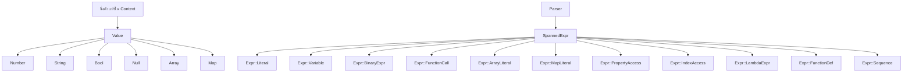

โมเดลข้อมูลรันไทม์คือข้อตกลงระหว่าง parser และ evaluator ใน `bl1z` โมเดลนี้กระจายอยู่ใน `src/value.rs`, `src/context.rs`, `src/ast.rs` และ `src/span.rs` เมื่อรวมกันแล้ว โมดูลเหล่านี้จะตอบคำถามสี่ข้อ: สูตรสามารถสร้างค่าอะไรได้บ้าง, ข้อมูลภายนอกถูกส่งเข้ามาอย่างไร, นิพจน์ถูกแสดงผลอย่างไร และตำแหน่งต้นฉบับถูกรักษาไว้ได้อย่างไร

## What This Concept Is

crate นี้จะลดรูปสูตรให้เหลือเพียง enum รันไทม์เดียวคือ `Value` และแสดงไวยากรณ์ด้วย `Expr` ที่ถูกห่อหุ้มใน `SpannedExpr` ข้อมูลแอปพลิเคชันจะถูกเก็บไว้ใน `Context` ซึ่งใช้ที่เก็บข้อมูลแบบ deterministic ต่อ scope พร้อม parent-linked lookup ส่วน `Span` และ `Position` จะทำหน้าที่แนบพิกัดที่มนุษย์อ่านได้เข้ากับไวยากรณ์และข้อผิดพลาด

## Why It Exists

โมเดลนี้ช่วยแก้ปัญหาทั่วไปในระบบสูตร: เมื่อคุณยอมรับภาษาที่มีความยืดหยุ่น (dynamic language) คุณยังคงต้องการรูปแบบภายในที่คาดเดาได้ `Value` จัดหารูปแบบนั้นให้, `Context` สร้างขอบเขตระหว่างโค้ดสูตรและข้อมูลแอปพลิเคชันโฮสต์ และ span ช่วยให้การวินิจฉัยสามารถชี้กลับไปยังต้นฉบับดั้งเดิมแทนที่จะล้มเหลวโดยไม่มีบริบท

## Internal Structure

`src/value.rs` กำหนดดังนี้:

```rust
pub enum Value {
    Number(f64),
    String(String),
    Bool(bool),
    Null,
    Array(Vec<Value>),
    Map(std::collections::HashMap<String, Value>),
    Lambda(...),
    DateTime(jiff::Timestamp),
    Duration(bl1z::value::Duration),
    Set(std::collections::HashSet<Value>),
    Range { start: i64, end: i64, step: i64 },
}
```

`src/context.rs` เก็บตัวแปรไว้ใน `BTreeMap<String, Value>` ส่วนตัวต่อหนึ่ง scope และเปิดเผยฟังก์ชัน `new`, `set`, `get`, `with_parent`, `get_all` และ `depth` ในระหว่างการประมวลผล `src/eval.rs` จะค้นหาตัวแปรตามชื่อและรองรับ AST nodes สำหรับ property access และ indexing โดยตรง

`src/ast.rs` กำหนดโครงสร้างต้นไม้ไวยากรณ์ (syntax tree) ส่วนสำคัญคือทุกนิพจน์จะกลายเป็น `SpannedExpr` ซึ่งห่อหุ้ม `Expr` พร้อมด้วย `ExprMeta { span }` อาร์เรย์และแมปเป็นโหนดระดับแรก (first-class nodes) ใน AST ไม่ใช่แค่เทคนิคหลังการประมวลผล



## How It Relates To Other Concepts

[Execution Pipeline](/docs/execution-pipeline) เป็นตัวสร้างโครงสร้างเหล่านี้, [Function System](/docs/function-registry) นำไปใช้งาน และชั้น [Error Reporting](/docs/error-reporting) จะพึ่งพา `Span` เพื่อสร้างข้อมูลการวินิจฉัยที่มีประโยชน์ หากคุณต้องการการเข้าถึงแบบออบเจ็กต์ที่ซ้อนกันในสูตร หน้านี้คือจุดที่มีการกำหนดพฤติกรรมดังกล่าวไว้

## Basic Usage: Supplying Variables

```rust
use bl1z::builtins;
use bl1z::{evaluate, parse, tokenize, Context, FunctionRegistry, Value};

fn main() -> Result<(), Box<dyn std::error::Error>> {
    let mut registry = FunctionRegistry::new();
    builtins::register_all(&mut registry);

    let mut ctx = Context::new();
    ctx.set("subtotal", Value::Number(120.0));
    ctx.set("discount", Value::Number(20.0));

    let ast = parse(&tokenize("subtotal - discount")?)?;
    let result = evaluate(&ast, &ctx, &registry)?;

    assert_eq!(format!("{result:?}"), "Number(100.0)");
    Ok(())
}
```

## Advanced Usage: Nested Maps With Dot Access

```rust
use bl1z::builtins;
use bl1z::{evaluate, parse, tokenize, Context, FunctionRegistry, Value};
use std::collections::HashMap;

fn main() -> Result<(), Box<dyn std::error::Error>> {
    let mut registry = FunctionRegistry::new();
    builtins::register_all(&mut registry);

    let mut profile = HashMap::new();
    profile.insert("name".to_string(), Value::String("Alice".to_string()));
    profile.insert("score".to_string(), Value::Number(91.0));

    let mut user = HashMap::new();
    user.insert("profile".to_string(), Value::Map(profile));

    let mut ctx = Context::new();
    ctx.set("user", Value::Map(user));

    let ast = parse(&tokenize("if(user.profile.score > 90, upper(user.profile.name), \"review\")")?)?;
    let result = evaluate(&ast, &ctx, &registry)?;

    assert_eq!(format!("{result:?}"), "String(\"ALICE\")");
    Ok(())
}
```

<Callout type="warn">การเข้าถึง property ยังคงต้องอาศัยค่ากลางที่เป็น `Value::Map` หรือค่าที่รองรับจริงในรันไทม์ แต่ภาษาปัจจุบันรองรับทั้ง array indexing (`items[0]`) และ chained access บนผลลัพธ์ที่ประเมินแล้วได้ คีย์แบบใส่เครื่องหมายอัญประกาศใน map literals ยังไม่ใช่ส่วนหนึ่งของไวยากรณ์สูตร</Callout>

## Trade-Offs

<Accordions>
<Accordion title="ทำไม Value ถึงเป็น enum เดียวแทนที่จะเป็นนิพจน์แบบ generic typed">
การใช้ `Value` enum เดียวทำให้ evaluator ใน `src/eval.rs` นำไปใช้งานและทำความเข้าใจได้ง่าย ทุกตัวดำเนินการและ built-in สามารถตรวจสอบชุดรูปแบบคงที่ขนาดเล็กได้ และโค้ดแอปพลิเคชันสามารถจัดเก็บโครงสร้างที่ซ้อนกันได้โดยไม่ต้องสร้าง custom trait objects ข้อเสียคือการตรวจสอบประเภทข้อมูลทั้งหมดจะเกิดขึ้นในขณะรันไทม์ ดังนั้นสูตรที่ไม่ถูกต้องจะล้มเหลวในระหว่างการประมวลผลด้วยรหัส `E401` แทนที่จะถูกปฏิเสธตั้งแต่ขั้นตอน static โดยระบบประเภทข้อมูลของ Rust สำหรับภาษาของสูตรที่เขียนโดยผู้ใช้ ข้อแลกเปลี่ยนนั้นมักจะคุ้มค่าเพราะแอปพลิเคชันโฮสต์ยังคงควบคุมได้ว่าข้อมูลใดจะเข้าสู่รันไทม์
</Accordion>
<Accordion title="ทำไมแมปถึงใช้คีย์ที่เป็น identifier ในสูตร">
Map literals ใน `src/parser.rs` ยอมรับเฉพาะคีย์ที่เป็น identifier เท่านั้น ตามที่แสดงในสาขาของ parser ที่คาดหวัง `TokenKind::Identifier` ก่อนเครื่องหมาย `:` สิ่งนี้ช่วยให้ไวยากรณ์มีขนาดเล็กลงและสอดคล้องกับการเข้าถึงแบบใช้จุด เพราะทั้งสองกรณีถือว่าคีย์มีลักษณะคล้าย identifier ข้อเสียคือคีย์ที่มีช่องว่างหรือเครื่องหมายวรรคตอนไม่สามารถเขียนลงในสูตรได้โดยตรง แม้ว่า `Value::Map` เองจะสามารถเก็บคีย์ `String` ใดๆ ก็ตาม หากแอปพลิเคชันของคุณต้องการคีย์แบบใดก็ได้ ให้แปลงคีย์เหล่านั้นก่อนใส่ลงใน `Context` หรือเปิดเผยฟังก์ชันตัวช่วยที่แปลงข้อมูลที่ซับซ้อนให้อยู่ในรูปแบบที่สูตรใช้งานได้ง่าย
</Accordion>
</Accordions>

สำหรับนิยามและลายเซ็นฟังก์ชันที่แน่นอน โปรดดู [Syntax and Evaluation](/docs/api-reference/syntax-and-evaluation) และ [Context and Functions](/docs/api-reference/context-and-functions)
